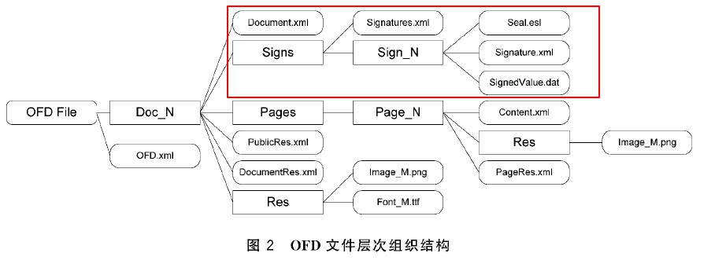
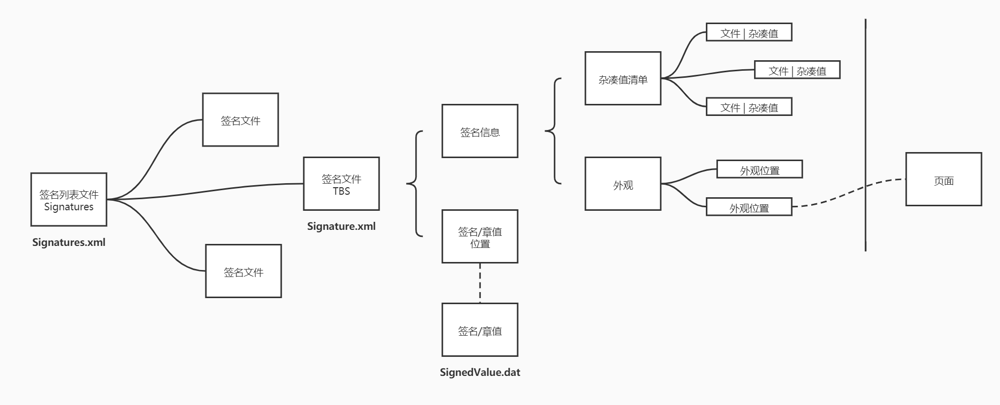

# OFD Reader & Writer 数字签名

## OFD数字签名体系

## 原文描述

内容来自于[《GB/T 33190-2016 电子文件存储与交换格式版式文档》](../GBT_33190-2016_电子文件存储与交换格式版式文档.pdf) 
18章 数字签名。

在文档结构章节中我们可以看到在虚拟容器系统中OFD数字签名相关的独立容器

关于签名列表文件和签名文件的介绍下方直接引用了标准内容：

**签名列表：**

签名列表文件的入口点在 7.4 主入口中定义。签名列表文件中可以包含多个签名（例如联合发文等情况），见图 85。
当允许下次继续添加签名时，该文件不会被包含到本次签名的保护文件列表（References）中。

**签名文件：**

OFD的数字签名通过对描述文件的保护间接实现对OFD原文的保护。
签名结构中的签名信息（SignedInfo）是这一过程中的关键点，
其中记录了当次数字签名保护的所有文件的二进制摘要信息，同时
将安全算法提供者、签名算法、签名时间、和所应用的安全印章等
信息也包含在此节点内。签名描述文件同时包含了签名值将要存放的
包内位置，一旦对该文件实施签名保护，则其对应的包内文件原文
以及本次签名对应的附加信息都将不可改动，从而实现依次数字签名
对整个原文内容的保护。签名描述文件的主要结构描述见图 86。

### 体系

数字签名的体系结构如下：

对于整个文档来说有一份数字签名列表的清单，记录该文档相关的所有数字签名信息位置
也就是 **签名列表文件** `Signatures.xml`。

签名列表文件存储的各个签名文件的位置，签名文件中包含一系列的数据用于保护文档，
而签名文件就是待签名的数据（To Be Sign, TBS）。

签名文件中主要是两个部分构成：

- 文件杂凑值清单，描述所保护的文件的杂凑值清单。
- 外观位置描述，它描述了签章可视化的注解所在的页面和页面内坐标。

OFD中文档和数字签名时两个相对独立的模块，他们各自拥有独立的ID体互不干扰。

### 签章外观

为了简单描述问题

- 用于文档显示生成相关的内容称为：文档体系。
- 用于签名相关的内容称为：签名体系。

数字签名的外观由文档中注释对象来描述，注释对象是放置于页面中的一种特殊对象，它与页面产生直接关联。

文档体系和签名体系相对独立，因此数字签名在表示外观时采用了 **页面 + 位置** 的方式来描述签名的外观。

如下：

显然这是一种相对来说比较弱的绑定方式，我推测采取这种方式的原因是为了让
签名体系的相对独立于文档体系中，由于文档体系来控制如何显示内容，而签名体系控制
如何保护文件，而避免让签名体系过多介入文档渲染的操作。

## 签名分析

### 涉及文件分析

根据标准原文描述：***签名列表文件中可以包含多个签名（例如联合发文等情况），见图 85。当允许下次继续添加签名时，该文件不会被包含到本次签名的保护文件列表（References）中。***。
          
因此一份文档可能含有多个签章。
